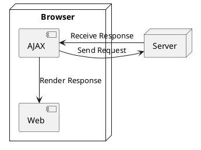

```puml
@startuml
node "Browser" as browser {
    component "AJAX" as ajax
    component "Web" as web
}
node "Server" as server

ajax -right-> server : Send Request
server -left-> ajax : Receive Response
ajax --> web : Render Response
@enduml
```
