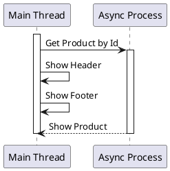

```puml
@startuml

participant "Main Thread" as App
participant "Async Process" as Async

activate App
App -> Async : Get Product by Id
activate Async
App -> App : Show Header
App -> App : Show Footer
Async --> App : Show Product
deactivate Async
deactivate App

@enduml
```
